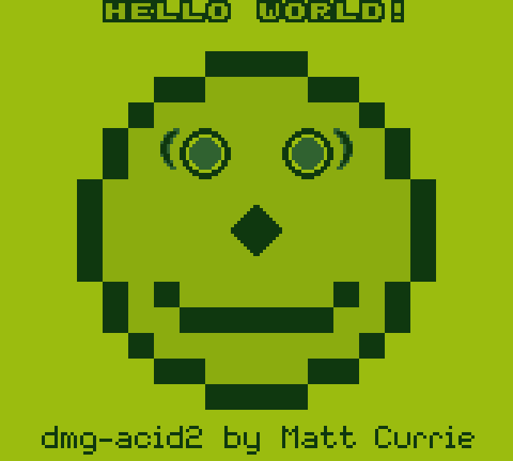
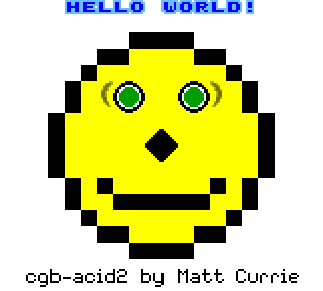
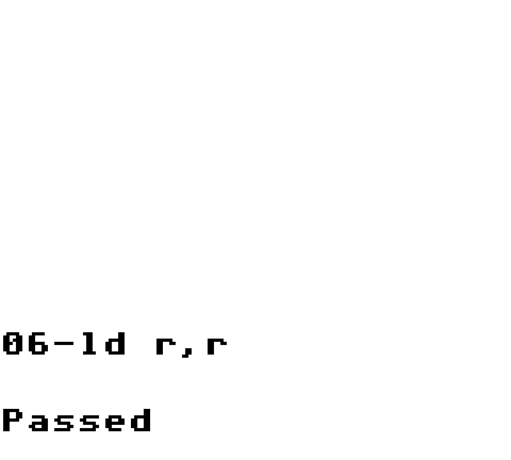
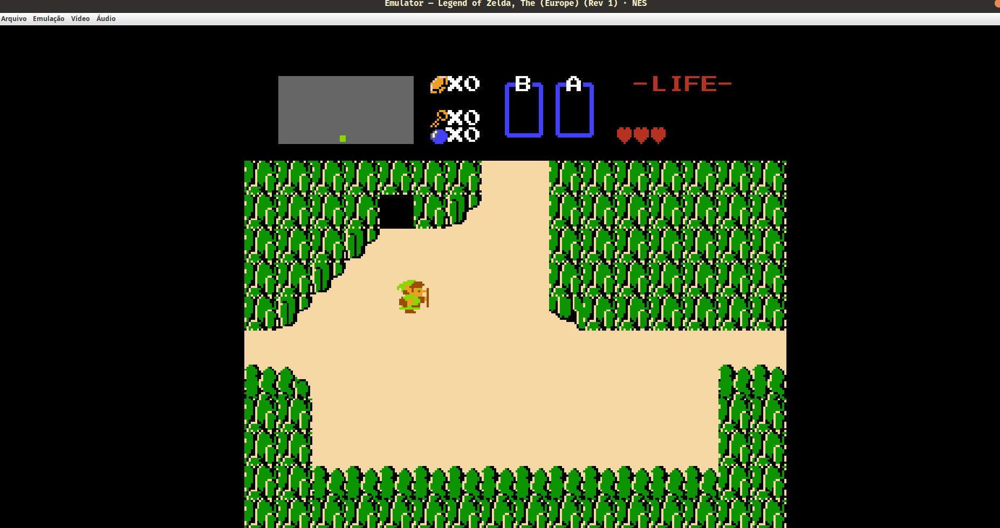
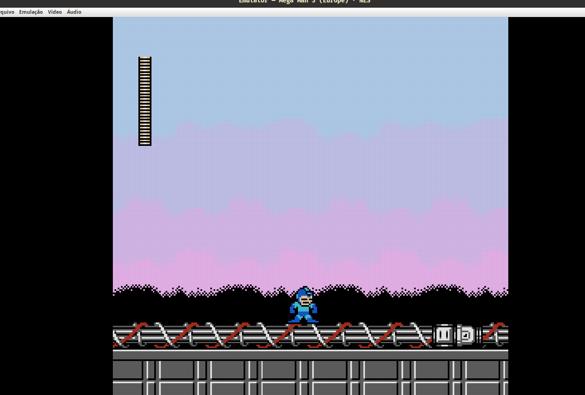
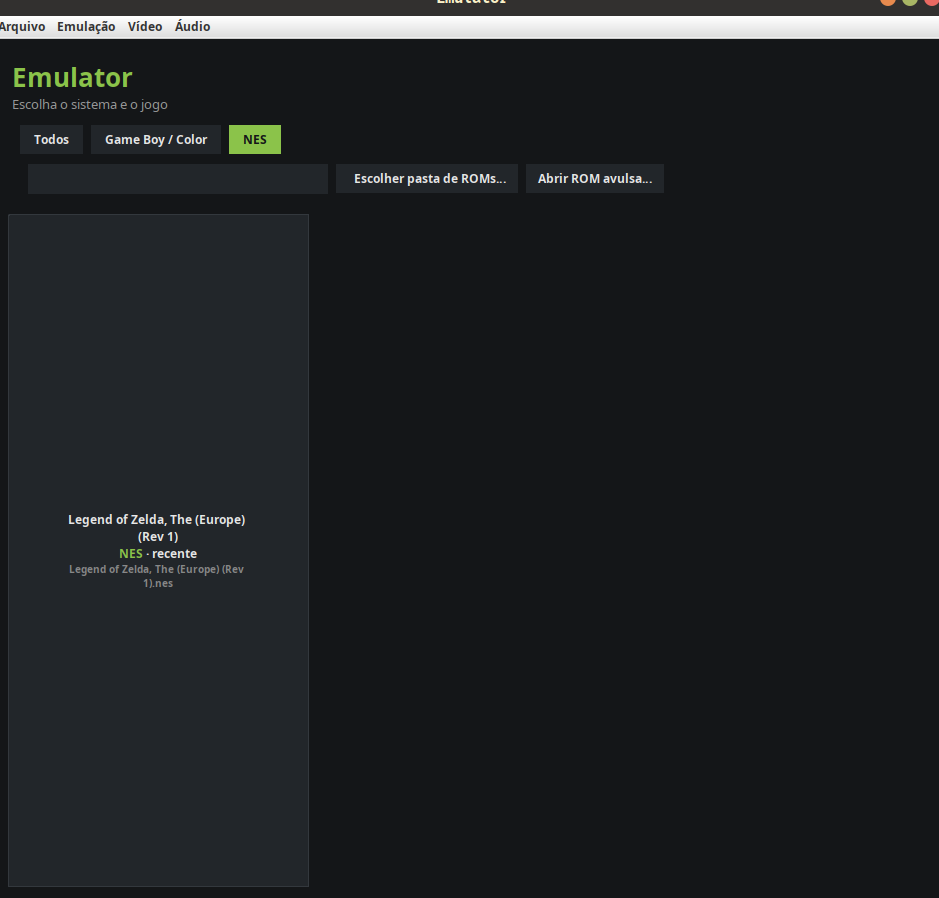
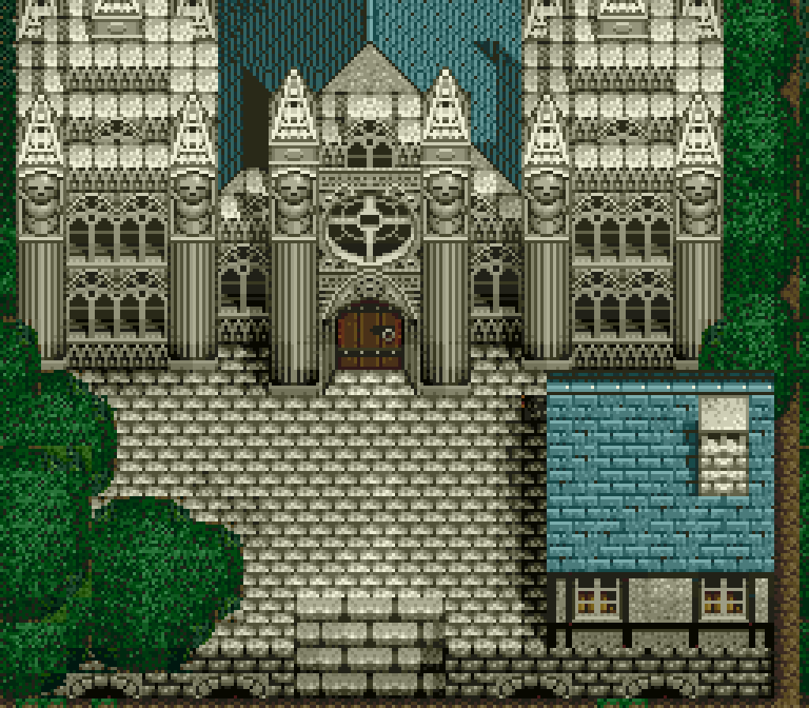
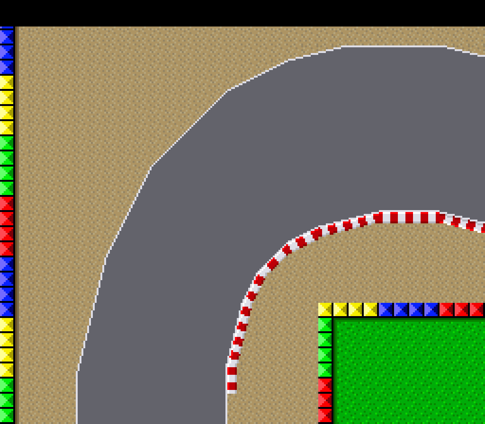
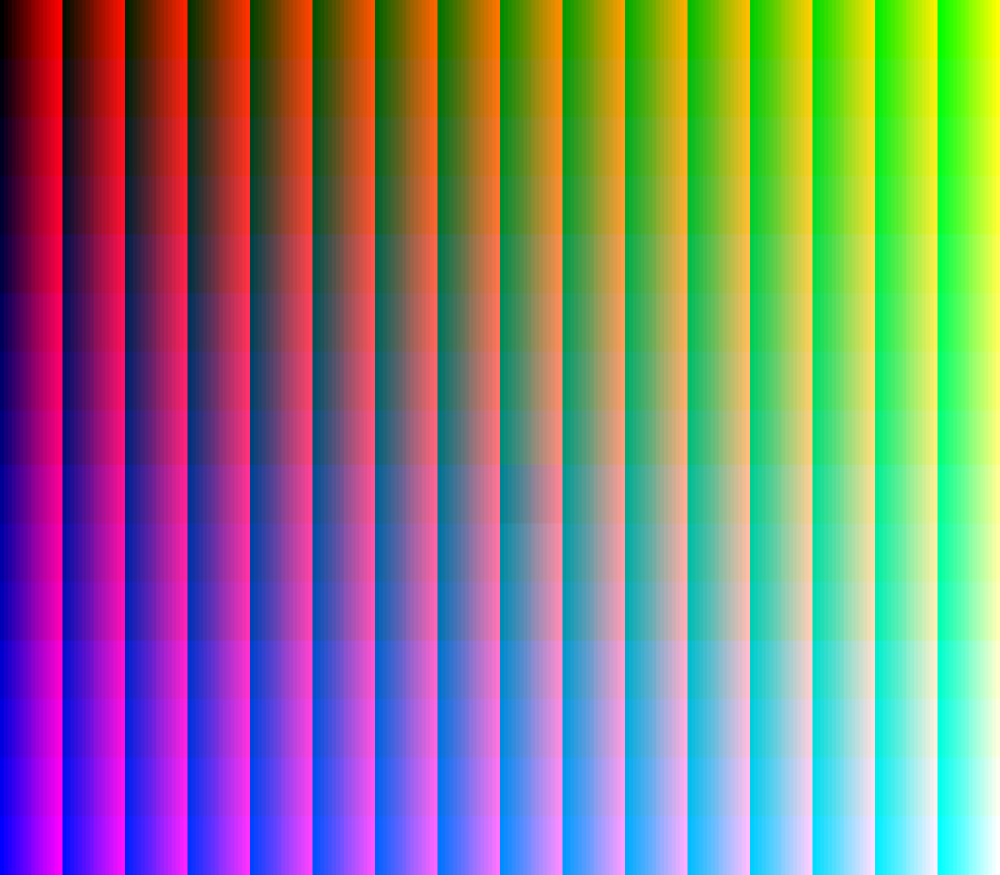

<div align="center">

# 🎮 gameboy-emulator

**Primeiro construímos a máquina. Depois, o jogo que roda nela.**

Um emulador de Game Boy & Game Boy Color escrito do zero em Kotlin — preciso ao nível de
referência, validado por testes — e uma **ROM homebrew autoral** feita para rodar nele.
Os dois lados do cartucho, construídos aqui.


<br>

<a href="CONSTRUCAO.md"></a>
<a href="homebrew/cinza/README.md"></a>
<br>
<a href="#-rodando"></a>
<a href="CONTRIBUTING.md"></a>

<br><br>

  

<sub>Renderizado pelo próprio emulador · validado **pixel a pixel** contra as imagens de referência da comunidade.</sub>

</div>

---

## 📖 A história, em dois atos

<table>
<tr>
<td width="50%" align="center" valign="top">

### 🏗️ Ato 1 — A máquina

<sub>CPU SM83 M-cycle · PPU pixel-FIFO · APU · MBCs<br>
o método, os bugs e as lições — na ordem em que aconteceram</sub>

<br><br>

<a href="CONSTRUCAO.md"></a>

</td>
<td width="50%" align="center" valign="top">

### 🕹️ Ato 2 — O jogo

<a href="homebrew/cinza/README.md"></a>

<sub><b>CINZA</b> — ROM autoral de GBC (MBC5, 128 KiB), gerada por scripts,<br>rodando no emulador deste repositório</sub>

<br><br>

<a href="homebrew/cinza/README.md"></a>

</td>
</tr>
</table>

## 🕹️ Rodando de verdade

<div align="center">

 

<sub><b>The Legend of Zelda</b> (MMC1) e <b>Mega Man 3</b> (MMC3) rodando no app desktop. O
gradiente do céu do Mega Man 3 é um efeito por scanline dirigido pelo <b>IRQ do MMC3</b> —
prova visual de que o mapper e a interrupção de scanline funcionam num jogo comercial de
verdade (o filtro de scanlines está ligado na captura).</sub>

<br><br>



<sub>A biblioteca multi-sistema: abas por console, busca e cards por jogo.</sub>

<br><br>

  

<sub><b>SNES (beta)</b> — a PPU renderizando contra as ROMs de teste do PeterLemon: BG <b>8bpp</b>
(modo 3, 256 cores); <b>Mode 7</b> (transformação afim — a pista girada, como F-Zero/Mario Kart);
e <b>color math</b> (blend de duas camadas → gradiente de 3840 cores). Cadeia <b>CPU 65C816 → DMA → VRAM → PPU</b> completa.</sub>

</div>

## ✨ Destaques

- 🧠 **CPU SM83 M-cycle-accurate** — o sistema avança a cada acesso de memória, como o hardware.
- 🖼️ **PPU pixel-FIFO** — fundo, janela e sprites; **Game Boy Color** em cor real (RGB555, VRAM banking, HDMA, double-speed).
- 💾 **MBC1 / MBC2 / MBC3 (+RTC) / MBC5** + save de bateria + **save states** (4 slots).
- 🔊 **APU** de 4 canais (2 ondas quadradas, wave, ruído) com **canais mutáveis**.
- 🎮 **NES**: CPU 6502 validada instrução a instrução pelo `nestest.log`, PPU por scanline
  (scroll, sprites, sprite-0 hit), APU de 5 canais (incl. **DMC**), mappers NROM/MMC1/UNROM/CNROM/**MMC3**
  (com **IRQ de scanline** — o split de tela de SMB3, Mega Man e cia.).
- 🟣 **SNES (beta)**: CPUs **65C816** e **SPC700** validadas contra os ProcessorTests, PPU
  (**modos 0–4 + Mode 7 + color math**, 2/4/8bpp, sprites), DMA/HDMA e o **APU com SPC700 real** (IPL + handshake). Falta o **DSP** (síntese de áudio) para o som e para jogos como o SMW completarem o boot.
- 🕹️ **App desktop multi-sistema**: seletor de console, biblioteca de ROMs, velocidade 0.25×–8× + turbo, tela cheia, filtros, paletas, cheats e gamepad.
- 🎨 **Cores autênticas por padrão** — filtros e correção de cor existem, mas nascem desligados.
- ✅ **640 testes automatizados** — Blargg, dmg/cgb-acid2, mooneye, nestest e ProcessorTests (65C816 + SPC700).

## 🎯 Precisão

A precisão não é opinião — é medida por ROMs de teste da comunidade, executadas pela suíte (`./gradlew test`):

| Suíte de teste | O que valida | Status |
|---|---|---|
| **Blargg `cpu_instrs`** | todos os ~500 opcodes da CPU | ✅ 10/10 |
| **Blargg `instr_timing`** | timing (ciclos) das instruções | ✅ |
| **Blargg `mem_timing`** | timing dos acessos à memória (exige M-cycle) | ✅ |
| **Blargg `02-interrupts`** | despacho de interrupções | ✅ |
| **dmg-acid2** | PPU do Game Boy (fundo/janela/sprites/prioridade) | ✅ pixel-perfect |
| **cgb-acid2** | PPU do Game Boy **Color** (paletas/atributos) | ✅ pixel-perfect |
| **mooneye** | banking (MBC1/5), timer, DAA, e mais | ✅ 24 testes |
| **nestest** (NES) | CPU 6502: 8991 instruções comparadas com o log de referência (PC, registradores, flags, ciclos) | ✅ instrução a instrução |
| **ProcessorTests** (SNES CPU) | 65C816: 254 opcodes em modo emulação, ~2,5 mi de vetores estado-a-estado | ✅ |
| **ProcessorTests** (SNES APU) | SPC700: 256 opcodes, estado a estado (A/X/Y/SP/PC/PSW + RAM) | ✅ |
| **Save states** | determinismo (snapshot → replay idêntico), GB, NES e SNES | ✅ |

<div align="center">
<sub>Quer entender <i>como</i> cada elo dessa cadeia foi conquistado?</sub><br><br>
<a href="CONSTRUCAO.md#11-a-cadeia-de-validação"></a>
</div>

## 🏗️ Arquitetura

O **núcleo (`:core`)** é Kotlin/JVM puro — não conhece front-end — e é testável sem dispositivo.

```
GameBoy (scheduler: CPU → PPU/APU/timer a cada M-cycle)
├── Cpu (SM83)      · Registers · Interrupts
├── Ppu (pixel-FIFO, DMG + CGB)
├── Apu (4 canais)  · Timer · Joypad
├── Memory (mapa de endereços, HDMA, WRAM banking)
└── Cartridge → Mbc (RomOnly · MBC1 · MBC2 · MBC3+RTC · MBC5) + Cheats

:api      interface EmulatorCore — o contrato que qualquer console implementa
:nes      NES — CPU 6502 (nestest), PPU scanline, APU, mappers 0–4 (MMC3+IRQ)
:snes     SNES — CPUs 65C816 + SPC700 (ProcessorTests), PPU modos 0-4 + Mode 7, DMA/HDMA, APU c/ IPL (beta)
:cli      runner (serial, trace, screenshot, save, paleta)
:desktop  app multi-sistema (seletor de console, biblioteca, áudio, gamepad, save states…)
homebrew/ CINZA — ROM autoral + artigo técnico
```

## 🚀 Rodando

Requer **JDK 21** (o wrapper do Gradle já vem incluído).

```bash
# rodar todos os testes (CPU + PPU + Blargg + acid2 + mooneye)
./gradlew test

# abrir o app desktop (com ou sem uma ROM)
./gradlew :desktop:run
./gradlew :desktop:run --args="homebrew/cinza/cinza.gb"

# instalar um ATALHO CLICÁVEL no menu de aplicativos (Linux), com ícone de Game Boy
./install-desktop.sh
```

Depois do instalador, procure **"GB Emulator"** no menu e clique — abre direto na
biblioteca de ROMs. A **CINZA** (`homebrew/cinza/cinza.gb`) já vem no repositório: é uma
ROM autoral, livre, pronta para jogar.

## 🎛️ Recursos do app desktop

- **Biblioteca multi-sistema**: abas por console, busca, cards (título + badge DMG/🌈GBC) e ROMs recentes.
- **Emulação**: pausar, velocidade 0.25×–8×, turbo (<kbd>TAB</kbd>), **save states** em 4 slots (<kbd>F1</kbd>–<kbd>F4</kbd> / <kbd>F5</kbd>–<kbd>F8</kbd>).
- **Controles** (menu *Emulação → Configurar controles*): abas **Teclado** e **Controle**, ambos remapeáveis no modo "pressione para aprender" e salvos automaticamente. No Linux o gamepad é lido direto de `/dev/input/js*` (sem bibliotecas nativas), com **hotplug** e defaults prontos para controle padrão Xbox.
- **Vídeo**: escala 2×–6×, tela cheia (<kbd>F11</kbd>), overlay de FPS, 8 paletas para jogos DMG.
  Filtros (scanlines / LCD grid / ghosting) e correção de cor CGB existem como opção — **desligados por padrão**: a imagem nasce fiel ao que o jogo define.
- **Áudio**: mudo, volume, liga/desliga cada canal.
- **Extras**: **cheats** (Game Genie / GameShark), autosave/continuar, arraste-a-ROM, screenshot (<kbd>F12</kbd>).

**Controles padrão:** setas = D-pad · <kbd>Z</kbd>/<kbd>X</kbd> = A/B · <kbd>Enter</kbd> = Start · <kbd>Shift</kbd> = Select · <kbd>Espaço</kbd> = pausar · <kbd>TAB</kbd> = turbo. Teclado e gamepad são remapeáveis em *Emulação → Configurar controles*.

## 🗺️ Roadmap

- [x] CPU SM83 M-cycle-accurate · Timer · Interrupções · Joypad
- [x] PPU pixel-FIFO (DMG) · **Game Boy Color** completo
- [x] MBC1/2/3(+RTC)/5 · save de bateria · save states
- [x] APU (som) · app desktop · atalho clicável
- [x] **CINZA** — ROM homebrew autoral rodando no emulador
- [x] **Arquitetura multi-sistema** — interface `EmulatorCore` + seletor de console na biblioteca
- [x] **NES** — CPU 6502 (nestest instrução a instrução), PPU, APU, mappers 0–3, save states
- [x] **NES fase 2** — MMC3 (banking + IRQ de scanline, destrava SMB3/Mega Man 3-6/Kirby…) e canal DMC (samples)
- [ ] **NES — precisão de barramento** — IRQ do MMC3 clocado por A12 real e PPU dot-accurate (o `mmc3_test` de conformidade estrita ainda falha; a aproximação por scanline cobre os jogos, não o teste exato)
- [ ] **SNES** — em construção pela escada de sempre:
  - [x] **CPU 65C816** — validada contra os ProcessorTests (254 opcodes em modo emulação, ~2,5 mi de vetores estado-a-estado)
  - [x] **Sistema bootável** — mapa de memória (LoROM/HiROM), DMA/HDMA, PPU (backgrounds modo 0-1, sprites), interrupções, controle; **roda ROMs de teste e renderiza backgrounds**
  - [x] **CPU SPC700** — o processador de som, validada contra os ProcessorTests (256 opcodes) + IPL boot ROM e handshake real das portas (jogos comerciais fazem o upload do driver de som e passam do boot do APU)
  - [x] **PPU modos 0–4 + Mode 7 + color math** (2/4/8bpp, camadas BG1–4, grupos de paleta do modo 0, transformação afim, blending main/sub-tela) — validada contra as ROMs de teste do PeterLemon
  - [ ] **DSP** (síntese de áudio) + timing ciclo-a-ciclo — o que falta para jogos como o Super Mario World completarem o boot e tocarem som
  - [x] **PPU: janelas + mosaico** — validadas contra WindowHDMA e MosaicMode3
  - [ ] PPU: sprites com prioridade completa (hoje ficam sempre por cima)
- [ ] **N64** — pesquisa de longo prazo (MIPS + RSP; sem promessa de data)
- [ ] Cheat scanner · suporte a boot ROM · bits-exatos do MBC1

## ⚖️ Legal

O emulador é 100% original, e a única ROM distribuída aqui é **autoral**
([CINZA](homebrew/cinza/README.md)) — além das ROMs de teste livres da comunidade
(Blargg, dmg-acid2, cgb-acid2, mooneye), usadas na validação. ROMs comerciais não
acompanham o projeto e o `.gitignore` impede que entrem.

---

<div align="center">

### 📚 Continue lendo

<a href="CONSTRUCAO.md"></a>
<a href="homebrew/cinza/README.md"></a>
<a href="CONTRIBUTING.md"></a>

<sub>Licenciado sob <b>MIT</b> — veja <a href="LICENSE">LICENSE</a>.</sub>

</div>
