<div align="center">

# CINZA — anatomia de uma ROM de Game Boy Color

**Como um jogo nasce de arquivos de texto, o que o hardware faz com ele,
e tudo que descobrimos apanhando no caminho.**

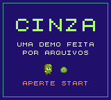

<sub>ROM homebrew (`cinza.gb`, nesta pasta) — feita editando JSONs, compilada pelo GB Studio,
executada no [emulador deste repositório](../../README.md). Eu tentei fazer uma room.
Não sei se ficou perfeito, mas eu definitivamente tentei.</sub>

<br><br>

<a href="../../README.md"></a>
<a href="../../CONSTRUCAO.md"></a>

</div>

---

## Resumo

CINZA é uma ROM de Game Boy Color de 128 KB construída quase inteiramente **sem tocar na
interface do editor**: os recursos do jogo (cenas, colisões, atores, diálogos, gatilhos)
foram gerados por scripts que escrevem os arquivos JSON que o GB Studio compila. Este
documento usa a CINZA como fio condutor para explicar, em profundidade, como um jogo de
Game Boy funciona — da sequência de boot ao pixel na tela, passando pela CPU, pela PPU,
pelo som e pelo cartucho — incluindo **medições feitas na própria ROM**, os erros que
cometemos, os limites reais do hardware e as técnicas que **não** usamos (e como seriam).
A ROM roda no emulador deste repositório, cuja precisão é validada por Blargg, mooneye,
dmg-acid2 e cgb-acid2 — ou seja: os dois lados do cartucho, o jogo e a máquina, foram
construídos do zero aqui.

## Sumário

1. [Introdução e método](#1-introdução-e-método)
2. [A máquina-alvo](#2-a-máquina-alvo)
3. [O que acontece quando você liga](#3-o-que-acontece-quando-você-liga)
4. [O cartucho: cabeçalho, checksums e bancos](#4-o-cartucho-cabeçalho-checksums-e-bancos)
5. [A CPU SM83](#5-a-cpu-sm83)
6. [O tempo: timers e o quadro de 70224 dots](#6-o-tempo-timers-e-o-quadro-de-70224-dots)
7. [Gráficos I: tudo é tile](#7-gráficos-i-tudo-é-tile)
8. [Gráficos II: o pixel-FIFO](#8-gráficos-ii-o-pixel-fifo)
9. [Cor: a dor real das 8 paletas](#9-cor-a-dor-real-das-8-paletas)
10. [Sprites: 40 vagas, 10 por linha](#10-sprites-40-vagas-10-por-linha)
11. [Som: a APU](#11-som-a-apu)
12. [Entrada: a matriz do joypad](#12-entrada-a-matriz-do-joypad)
13. [A toolchain: do JSON ao binário](#13-a-toolchain-do-json-ao-binário)
14. [Engenharia da CINZA](#14-engenharia-da-cinza)
15. [O que NÃO fizemos (e como se faria)](#15-o-que-não-fizemos-e-como-se-faria)
16. [Validação: a cadeia de confiança](#16-validação-a-cadeia-de-confiança)
17. [Curiosidades históricas](#17-curiosidades-históricas)
18. [Trabalhos futuros](#18-trabalhos-futuros)
19. [Galeria](#19-galeria)

## 1. Introdução e método

Este projeto respondeu a uma pergunta aparentemente boba — *"como eu faço a minha
própria room?"* — do jeito mais longo possível.

Uma decisão definiu tudo: **não abrir a IDE**. O GB Studio tem um editor gráfico
excelente — dá para arrastar cenas, pintar colisão com o mouse, montar diálogos em menus.
Ignoramos deliberadamente. A regra do jogo era: *se o editor faz X quando você clica,
nós descobrimos o que X escreve em disco e escrevemos nós mesmos*. Não por masoquismo —
era a diferença entre **usar** uma ferramenta e **entender** o que ela produz. Clicar
num checkbox de colisão não ensina nada; descobrir que aquele clique vira um byte de
flags direcionais dentro de uma string RLE (§14.2) ensina o formato, o porquê do
formato, e o custo dele na ROM.

E — precisa ser dito — **foi divertido demais**. Cada formato era um quebra-cabeça com
gabarito embutido: a hipótese ou reproduz a saída do editor byte a byte, ou está errada.
Não tem "acho que entendi". A sensação de rodar o diff e ver zero diferenças depois de
decifrar a compressão da colisão é a mesma de fechar um puzzle — e vinha em série:
o esquema dos eventos, o posicionamento dos atores, os checksums do cabeçalho. Por baixo
de cada abstração bonitinha do editor havia uma mecânica concreta esperando ser
descoberta, e cada uma descoberta destravava a próxima.

**Como estudamos:** arqueologia de código dos dois lados. Do lado da ferramenta, o GB
Studio é Electron com fonte aberto — extraímos o código do editor e lemos as funções de
serialização na fonte, em vez de adivinhar por tentativa e erro. Do lado do hardware,
[Pan Docs](https://gbdev.io/pandocs/) como mapa, as ROMs de teste da comunidade como
gabarito — e **o nosso próprio emulador como microscópio**: o modo `--trace` do `:cli`
mostra a CPU executando instrução a instrução o binário que acabamos de gerar, e o
`--screenshot` congela qualquer quadro para inspeção. Construir a máquina antes do jogo
(ver [CONSTRUCAO.md](../../CONSTRUCAO.md)) pagou exatamente aqui: nenhuma camada da
pilha era caixa-preta.

O método, olhando em retrospecto, teve três pilares:

1. **Engenharia reversa por round-trip.** Antes de escrever qualquer arquivo do jogo,
   extraímos o código do editor (GB Studio 4.2.0) e reimplementamos seus formatos
   (compressão de colisão, esquema dos eventos). Um formato só era considerado
   "entendido" quando nossa implementação reproduzia **byte a byte** a saída do editor
   sobre dados reais.
2. **Geração procedural com validação visual.** Cada cena, colisão e NPC foi gerado por
   script — e cada geração produzia uma imagem de verificação (colisão sobreposta ao
   cenário, portas, pontos de spawn) inspecionada antes de aplicar.
3. **Verificação em três elos** (§16): checksums da ROM, testes de precisão do
   emulador, execução do jogo no emulador.

O resto deste artigo percorre o hardware e o software na ordem em que um cartucho os
encontra: boot → cartucho → CPU → tempo → vídeo → som → entrada → toolchain → o jogo.

## 2. A máquina-alvo

O Game Boy Color é, em essência, um computador de 8 bits congelado no tempo:

| componente | especificação |
|---|---|
| CPU | Sharp **SM83** (híbrido 8080/Z80), 4.194304 MHz (2²²); GBC dobra para 8.388608 MHz |
| Tela | 160×144 pixels, ~59.73 quadros/s (1 quadro = 70224 dots) |
| VRAM | 8 KB (DMG) / 2×8 KB com bancos (GBC), em `0x8000–0x9FFF` |
| WRAM | 8 KB (DMG) / 32 KB em 8 bancos (GBC) |
| Sprites | 40 objetos em OAM, máx. **10 por linha** |
| Cores | 4 tons (DMG) / 32768 cores RGB555, 8 paletas de BG + 8 de OBJ (GBC) |
| Som | 4 canais: 2 pulsos, 1 wave, 1 ruído |

Tudo vive num único espaço de endereços de 64 KB — não existe "sistema operacional",
só memória mapeada:

```
0000–3FFF  ROM banco 0 (fixo)          ┐
4000–7FFF  ROM banco chaveável (MBC)   ┘ o cartucho
8000–9FFF  VRAM (tiles + mapas; 2 bancos no GBC)
A000–BFFF  RAM do cartucho (o save!)
C000–DFFF  WRAM (8 bancos no GBC)
FE00–FE9F  OAM (tabela de sprites)
FF00–FF7F  registradores de I/O (PPU, APU, timer, joypad...)
FF80–FFFE  HRAM (127 bytes de RAM "vip")
FFFF       IE — habilitação de interrupções
```

Escrever o byte certo no endereço certo **é** a API inteira do console. Não há syscalls,
não há drivers: `LD (FF40), A` liga a tela, e é isso.

## 3. O que acontece quando você liga

Antes do jogo, roda a **boot ROM** — um programinha gravado dentro do console (256
bytes no DMG), mapeado em `0x0000`:

1. inicializa a RAM e o som (o "pó-ling!" é ela);
2. copia o **logo da Nintendo do cartucho** para a VRAM e o desce pela tela;
3. compara o logo do cartucho com uma cópia interna — **diferente? congela**;
4. confere o checksum do cabeçalho — **não bate? congela**;
5. escreve em `0xFF50`, o que **desmapeia a boot ROM para sempre** (só volta desligando),
   e salta para `0x100` — o cartucho assumiu.

Dois detalhes deliciosos:

- **O logo é uma trava jurídica, não técnica.** Como o logo é marca registrada, um
  cartucho pirata nos anos 90 era obrigado a *estampar a marca da Nintendo* para
  bootar — e aí podia ser processado por violação de marca. O hardware como advogado.
- **Como um jogo sabe que está num GBC?** Pela herança do boot: a boot ROM do GBC
  termina com o registrador **`A = 0x11`** (a do DMG deixa `A = 0x01`). A engine lê
  esse registrador na primeira instrução útil e decide se liga o modo colorido. É
  literalmente assim que a CINZA "sabe" que pode usar paletas RGB555.

## 4. O cartucho: cabeçalho, checksums e bancos

Uma ROM começa a "existir" no byte `0x100`. O **cabeçalho** (`0x100–0x14F`) é o RG do
cartucho:

| bytes | conteúdo | na CINZA |
|---|---|---|
| `0x100–0x103` | ponto de entrada (`nop; jp 0x150`) | ✓ |
| `0x104–0x133` | logo da Nintendo (bitmap comprimido) | ✓ |
| `0x134–0x143` | título | `CINZA` |
| `0x143` | flag GBC (`0x80` = colorido compatível, `0xC0` = só GBC) | `0x80` |
| `0x146` | flag Super Game Boy | não usamos |
| `0x147` | tipo de cartucho | `0x1E` = MBC5+RUMBLE+RAM+BATERIA |
| `0x148` | tamanho da ROM (32 KB « n) | 128 KB = 8 bancos |
| `0x149` | tamanho da RAM externa | ✓ (o save dorme aqui) |
| `0x14D` | **checksum do cabeçalho** | ✓ bate |
| `0x14E–0x14F` | checksum global | ✓ bate |

A fórmula do checksum que decide se o jogo liga é deliciosamente crua:
`x = 0; para i de 0x134 a 0x14C: x = x - rom[i] - 1`. O global (`0x14E`), por outro
lado, **nenhum hardware confere** — só emuladores e ferramentas chatas. Os dois da
CINZA batem, por honra. E o `RUMBLE` no tipo `0x1E`? O GB Studio declara vibração por
padrão — num cartucho físico com motor, o bit 3 do registrador de banco de RAM liga o
motor. A CINZA tem rumble no papel e nenhum motor pra girar. 🌀

### 4.1 Bancos: enxergando 128 KB por uma janela de 32 KB

A CPU só enxerga 32 KB de ROM. Jogos maiores usam um chip no cartucho — o **MBC**
(Memory Bank Controller) — que troca qual fatia de 16 KB aparece na janela
`0x4000–0x7FFF`. O comando de troca é surreal para quem vem de máquinas modernas:
**escrever num endereço de ROM**. ROM não aceita escrita — mas o MBC está escutando o
barramento e intercepta: no MBC5, escrever em `0x2000` seleciona o banco (até 512
bancos = 8 MB; Pokémon Red usava 64).

Medimos a ocupação real dos 8 bancos da CINZA (contando o preenchimento até o padding):

```
banco 0:  93.7% ████████████████████████████   engine fixa (_HOME) + runtime
banco 1: 100.0% █████████████████████████████  ┐
banco 2: 100.0% ██████████████████████████████ │ tiles, mapas, paletas,
banco 3: 100.0% █████████████████████████████  │ bytecode das cenas
banco 4: 100.0% ██████████████████████████████ │
banco 5: 100.0% ██████████████████████████████ ┘
banco 6:   6.0% █                               sobras
banco 7:   0.0%                                 vazio
TOTAL:    75.0% da ROM (98 255 / 131 072 bytes)
```

O linker (§13) espalha o conteúdo: o banco 0 guarda o código que precisa estar sempre
visível; os bancos 1–5 guardam os dados das cenas. Sobra um banco e meio — espaço de
sobra para a trilha sonora que ainda não compusemos (§15).

## 5. A CPU SM83

O processador do Game Boy é um mal-entendido ambulante: não é um Z80, não é um 8080 —
é o **Sharp SM83**, um híbrido que pegou o conjunto base do 8080, algumas ideias do
Z80 (os prefixos `CB` de bit-ops) e inventou as suas:

- registradores de 8 bits `A F B C D E H L`, pareáveis em `AF BC DE HL`, mais `SP` e `PC`;
- flags `Z N H C` (zero, subtração, half-carry, carry) — o half-carry existe quase só
  para o `DAA` (aritmética decimal) funcionar;
- **não tem** os registradores sombra do Z80, nem `IX/IY`;
- **tem** o que o Z80 não tem: `SWAP` (troca nibbles), `LDH` (acesso rápido à página
  `0xFF00`, onde vivem os registradores de I/O — o hardware incentiva o layout da
  memória), `LD (HL±)` (lê/escreve e incrementa o ponteiro — feito para copiar tiles).

São ~500 opcodes (256 base + 256 prefixados `CB`, menos buracos). O emulador deste
repositório implementa todos, e o Blargg `cpu_instrs` (10/10) é quem confere.

### 5.1 Interrupções

Cinco fontes, cada uma com seu vetor fixo: **VBlank** (`0x40`), **STAT/LCD** (`0x48`),
**Timer** (`0x50`), **Serial** (`0x58`) e **Joypad** (`0x60`). O jogo típico vive num
loop: `HALT` (dorme economizando bateria) → interrupção do VBlank acorda → atualiza
OAM/VRAM na janela segura → lógica do quadro → `HALT` de novo. A CINZA inteira dança
nesse compasso de 59.73 Hz.

Curiosidades de silício que emulador tem que reproduzir:

- **EI atrasado**: `EI` só habilita interrupções **depois da instrução seguinte** —
  para permitir o idiom `EI; RETI` sem reentrada.
- **O bug do HALT**: `HALT` com interrupções globalmente desligadas e uma pendente faz
  o `PC` falhar em incrementar — **o byte seguinte executa duas vezes**. É um defeito
  do chip, mantido para sempre, e jogos comerciais dependem dele.

## 6. O tempo: timers e o quadro de 70224 dots

Duas engrenagens marcam o tempo do console:

**O timer do sistema.** `DIV` (`0xFF04`) expõe os bits altos de um contador interno de
16 bits que nunca para (escrever nele zera — e isso tem efeitos colaterais no som!).
`TIMA` conta em uma de 4 velocidades (`TAC`) e, ao estourar, recarrega de `TMA` e pede
interrupção — **mas a recarga acontece 1 M-cycle "atrasada"**, e nesse instante
fantasma escritas se comportam de forma bizarra. O teste `tima_reload` do mooneye
existe só para isso, e fechá-lo foi um commit deste repositório.

**A PPU.** A imagem é desenhada linha a linha, e cada linha tem um ritual:

```
modo 2 (80 dots)   → OAM scan: quais sprites tocam esta linha?
modo 3 (172–289)   → desenho: o pixel-FIFO empurra pixels pra tela
modo 0 (resto)     → HBlank: descanso até completar 456 dots
× 144 linhas visíveis, depois:
modo 1 (VBlank)    → 10 linhas de paz (~1.1 ms)
```

144×456 + 10×456 = **70224 dots = 1 quadro ≈ 59.73 Hz**. No hardware, durante o modo 3
a VRAM está **trancada** (ler devolve `0xFF`); durante os modos 2–3, a OAM idem. Por
isso "vsync" não é uma convenção de engine — é imposição física: o VBlank é o único
momento em que se pode mexer em tudo. E o tempo do emulador anda na granularidade do
**M-cycle**: cada acesso de memória da CPU avança PPU, APU e timers em 4 T-cycles — é
o que `mem_timing` exige.

## 7. Gráficos I: tudo é tile

Não existe framebuffer. Não dá pra "pintar um pixel" — a PPU compõe a imagem a partir
de **tiles de 8×8**, e é só isso que ela sabe fazer.

### 7.1 O formato 2bpp

Cada tile ocupa 16 bytes: 2 bytes por linha — um com os bits **baixos** e outro com os
bits **altos** da cor de cada pixel (2 bits/pixel = 4 cores). Exemplo real:

```
byte 1: 0x3C = 00111100   (plano baixo)
byte 2: 0x7E = 01111110   (plano alto)
                           cor do pixel i = (alto_i << 1) | baixo_i
pixels:         0 2 3 3 3 3 2 0
```

Por que dois planos separados em vez de 2 bits juntos? Porque o hardware desloca os
dois bytes em paralelo, um bit por pixel por clock — o formato **é** o circuito.

### 7.2 Do PNG pro hardware

O fundo de uma sala é um **tilemap**: uma grade 32×32 de índices (em `0x9800` ou
`0x9C00`) dizendo "aqui vai o tile nº N". Quando o GB Studio compila o PNG de uma
sala, ele corta em blocos 8×8, **deduplica** os idênticos e grava só os únicos — a
sala inicial da CINZA tem 360 posições, mas só **19 tiles únicos**; o chão repetido é
1 tile referenciado centenas de vezes. É compressão por vocabulário, e é por isso que
jogos inteiros cabiam em 128 KB.

A tela mostra uma janela de 20×18 tiles sobre o mapa de 32×32; `SCX/SCY` deslocam essa
janela — é assim que o scroll da Arena (30×34 tiles) funciona sem redesenhar nada. Há
ainda a **window**, uma segunda camada sem transparência que se sobrepõe (HUDs de jogos
comerciais moram nela; nossos corações são sprites — §10 explica a diferença).

## 8. Gráficos II: o pixel-FIFO

Dentro do modo 3, a PPU não copia tiles prontos — ela opera uma linha de montagem de
pixels, o **FIFO**:

- um *fetcher* busca, a cada 8 pixels: o índice no tilemap → o byte baixo do tile → o
  byte alto → e empurra 8 pixels na fila do fundo;
- quando um sprite começa naquela coluna, o fetcher do fundo **pausa**, busca os bytes
  do sprite e **mistura** as filas (comparando prioridade pixel a pixel);
- a fila empurra 1 pixel para o LCD por dot.

Consequência mensurável: o modo 3 tem duração **variável** (172–289 dots). Scroll com
`SCX % 8 ≠ 0` descarta pixels já buscados (paga-se o resto da divisão em dots);
**cada sprite na linha adiciona 6–11 dots** de pausa. Jogo cheio de sprite rouba tempo
de HBlank — e programador de raster effect (§15) sente isso na pele. Os testes
dmg-acid2/cgb-acid2, que este emulador passa pixel-perfect, verificam exatamente as
esquisitices dessa linha de montagem (prioridades, janela, flips).

## 9. Cor: a dor real das 8 paletas

No DMG, "cor" é um registrador (`BGP`): 4 índices → 4 tons de verde-cinza. No GBC,
cada tile do fundo aponta — via o **segundo banco da VRAM**, os "atributos" — para uma
de **8 paletas de 4 cores RGB555**. Máximo teórico: 32 cores simultâneas no fundo + 32
nos sprites (que têm suas próprias 8 paletas, com o índice 0 sempre transparente).

As paletas nem são endereçáveis diretamente: escreve-se um índice em `BCPS (0xFF68)` e
os bytes de cor, um a um, em `BCPD (0xFF69)` — 5 bits por canal, little-endian, 32768
cores possíveis.

Nós batemos nesse teto com força: os PNGs das salas `casa` e `loja` geravam **23 e 21
combinações únicas** de 4 cores por tile — quase o triplo do limite. A solução foi um
algoritmo de encaixe: agrupar os conjuntos de cores dos tiles em ≤8 paletas (mesclando
conjuntos cuja união tem ≤4 cores) e remapear os pixels dissidentes para a cor mais
próxima da paleta atribuída. Antes e depois — praticamente invisível:

<div align="center">
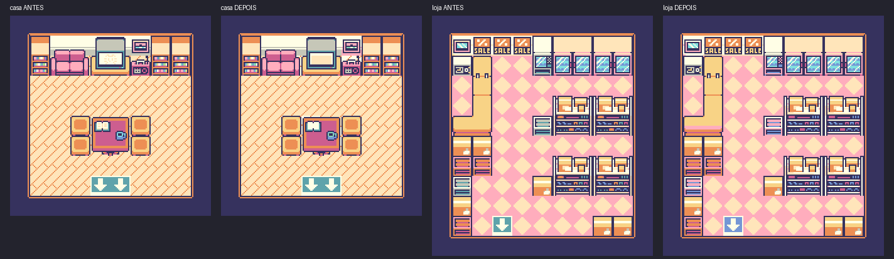
</div>

## 10. Sprites: 40 vagas, 10 por linha

Objetos que se movem (o herói, o Bit, os slimes, os corações do HUD, o projétil) não
vão no tilemap — são **sprites**, descritos na OAM: 40 entradas de 4 bytes
(`Y+16`, `X+8`, índice do tile, atributos). A CINZA usa o modo 8×16 (dois tiles
empilhados por sprite, configurado globalmente).

Dois fatos de hardware que todo jogo herda:

- **10 sprites por linha, e acabou.** Do 11º em diante a PPU simplesmente não desenha.
  Jogos comerciais piscam personagens alternadamente para ninguém sumir de vez
  (o flicker clássico das batalhas cheias). Na Arena da CINZA — herói + 5 slimes +
  3 corações + projétil = 10 objetos — encostamos no limite sem perceber: se tudo se
  alinhar na mesma linha, alguém pisca. Bug? Não: *hardware fielmente emulado*.
- **OAM DMA.** Reescrever os 160 bytes da OAM à mão é lento demais para um VBlank.
  A solução do hardware: escrever um byte em `0xFF46` dispara uma **cópia por DMA** de
  160 bytes em ~160 M-cycles — durante os quais a CPU só consegue executar código da
  HRAM. Por isso toda engine (a do GB Studio inclusa) copia uma rotininha de espera
  para a HRAM e a chama lá. Os 127 bytes de RAM "vip" existem em função disso.

## 11. Som: a APU

O som do Game Boy são **4 vozes** somadas analogicamente:

| canal | timbre | truques |
|---|---|---|
| 1 | onda quadrada | envelope de volume + **sweep** de frequência (o "piu~" de tiro) |
| 2 | onda quadrada | envelope (a segunda voz da melodia) |
| 3 | **wave**: 32 amostras de 4 bits em RAM (`0xFF30–0xFF3F`) | timbre "desenhável" — baixos, órgãos, vozes |
| 4 | ruído por **LFSR** (registrador de deslocamento) | bateria, explosões; modo 7-bit dá tom metálico |

Um **frame sequencer** de 512 Hz rege os automatismos: comprimento das notas a 256 Hz,
envelopes a 64 Hz, sweep a 128 Hz. Música é a CPU escrevendo nos registradores `NRxx`
na hora certa — o "driver de som" é um metrônomo de interrupções. O da CINZA
(**hUGEDriver**, padrão do GB Studio 4) já está compilado dentro da ROM; nós é que
ainda não escrevemos partitura para ele (§15).

O emulador implementa os 4 canais com liga/desliga individual — útil para "dissecar"
uma trilha ouvindo um canal por vez.

## 12. Entrada: a matriz do joypad

Os 8 botões são uma **matriz 2×4** lida por `P1 (0xFF00)`, com lógica ativa-baixa:
o jogo escreve qual metade quer ler (bit 4 = direcionais, bit 5 = A/B/Select/Start) e
lê 4 bits de resposta. Ler os 8 botões custa duas escritas + duas leituras — e é por
isso que, no hardware, **não existe "apertar ao mesmo tempo" perfeito**: as duas
metades são amostradas em instantes diferentes. A engine do GB Studio faz esse
polling a cada quadro e entrega o resultado pronto para o bytecode (o nosso
`EVENT_SET_INPUT_SCRIPT` do botão B pendura o ataque exatamente aí).

## 13. A toolchain: do JSON ao binário

A descoberta que destravou o projeto: **o GB Studio é um compilador disfarçado de
editor**. O pipeline completo, com os artefatos reais do build da CINZA:

```
*.gbsres (JSON) + *.png                      ← o que os nossos scripts escrevem
        │  GB Studio "ejeta" dados + scripts
        ▼
GBVM bytecode + C (engine) ──► GBDK-2020 (SDCC) compila
        ▼
cinza.ihx   (Intel HEX do linker)
cinza.map   (mapa do linker: o que foi parar em qual banco)
cinza.sym   (símbolos p/ debuggers: BGB, Emulicious)
cinza.noi   (idem, formato NoICE)
        ▼  makebin + correção de cabeçalho/checksums
cinza.gb    (a ROM)
```

Do `cinza.map` saem números concretos: a área `_HOME` (código sempre visível, banco 0)
tem **10 905 bytes**; `_CODE` soma 3 866; `_DATA` reserva 6 675 bytes de WRAM; e as
áreas `_CODE_1..6` são os bancos chaveáveis que medimos no §4.1. O linker resolve um
quebra-cabeça real: código que chama código de **outro banco** precisa de um
*trampolim* — uma funçãozinha no banco 0 que troca o banco no MBC, salta, e destroca
na volta. O GBDK gera esses trampolins automaticamente ("banked calls") — em assembly
escrito à mão, administrar isso é boa parte da dor de um jogo grande.

E o **GBVM** merece pausa: os eventos do editor não viram C — viram **bytecode**
interpretado por uma máquina virtual dentro da ROM. Sim: dentro do Game Boy de 8 bits
roda uma VM. É o mesmo truque de Pokémon e Zelda (scripts interpretados sobre uma
engine nativa), formalizado. Custa ciclos, compra expressividade — um diálogo inteiro
são poucos bytes de script em vez de dezenas de instruções.

### 13.1 E como seria em C, sem editor nenhum?

A pergunta natural depois de dispensar a IDE: dava para dispensar **tudo** e escrever o
jogo direto em C? Dava — a CINZA já é compilada pelo **GBDK-2020** por baixo; escrever
em C é só remover os dois andares de cima da pilha (editor e GBVM) e falar com a engine…
que nesse caso é você. Um "jogo" mínimo e completo — sprite andando com o d-pad — é isto:

```c
#include <gb/gb.h>
#include <stdint.h>

const uint8_t tile_heroi[16] = {
    0x3C,0x3C, 0x42,0x7E, 0xA5,0xDB, 0x81,0xFF,   // 8×8 em 2bpp: 2 bytes por linha,
    0xA5,0xFF, 0x99,0xFF, 0x42,0x7E, 0x3C,0x3C,   // byte low + byte high (§7)
};

void main(void) {
    set_sprite_data(0, 1, tile_heroi);   // copia o tile para a VRAM (0x8000)
    set_sprite_tile(0, 0);               // sprite 0 usa o tile 0 (escreve na OAM)
    SHOW_SPRITES;

    uint8_t x = 80, y = 72;
    while (1) {
        uint8_t j = joypad();            // lê a matriz do §12 (registrador 0xFF00)
        if (j & J_LEFT)  x--;
        if (j & J_RIGHT) x++;
        if (j & J_UP)    y--;
        if (j & J_DOWN)  y++;
        move_sprite(0, x + 8, y + 16);   // OAM guarda x+8 / y+16 (§10)
        vsync();                         // espera o VBlank — o "relógio" do jogo
    }
}
```

Compila com `lcc -o jogo.gb jogo.c` e roda neste emulador. Sem cena, sem evento, sem
VM: o *game loop* é um `while(1)` cru cadenciado pelo VBlank.

O que faz esse código ser honesto é que **cada helper é um verniz fino sobre um
registrador que este repositório emula**. `SHOW_SPRITES` expande para uma linha que
liga o bit 1 do LCDC — e nada impede de descer ao metal sem o header:

```c
#define LCDC (*(volatile uint8_t *)0xFF40)
LCDC |= 0x02;   // liga sprites: o MESMO bit que a PPU do emulador testa por quadro
```

`joypad()` lê `0xFF00` fazendo a dança das duas linhas da matriz (§12); `vsync()` dorme
num `HALT` até a interrupção de VBlank (`IE` bit 0 — §3); `move_sprite` escreve 2 bytes
na OAM que o *OAM scan* do emulador varre a cada linha (§10). A pilha inteira, vista de
cima:

```
GB Studio (JSONs de cenas/eventos)     ← onde a CINZA foi escrita
   └─ GBVM (bytecode + engine em C)
       └─ C puro + GBDK (gb/gb.h)      ← onde este exemplo vive
           └─ registradores crus (volatile uint8_t* em 0xFFxx)
               └─ SM83 assembly (SDCC gera; ou se escreve à mão em RGBDS)
                   └─ os bytes que a CPU deste emulador decodifica
```

Cada degrau para baixo troca conveniência por controle: o C puro não paga o custo da VM
e escolhe cada ciclo — mas agora **você** administra bancos (`#pragma bank 2` +
trampolins do §13), *double buffering* de OAM, e cada efeito do §15 vira código seu.
Jogos comerciais da era foram escritos no degrau de baixo (assembly à mão); a CINZA
foi escrita dois degraus acima — e o estudo foi justamente descobrir que os degraus
existem, onde ficam, e o que cada um esconde.

## 14. Engenharia da CINZA

### 14.1 O jogo em números (medidos dos fontes e da ROM)

| métrica | valor |
|---|---|
| cenas | 7 (título, seleção, 4 salas, arena) |
| atores | 28 (herói, Bit, NPCs, slimes, corações...) |
| gatilhos (portas) | 8 |
| sprites / fundos | 9 / 9 |
| eventos de script | **163** |
| caixas de diálogo | **61** |
| ROM ocupada | 98 255 / 131 072 bytes (75%) |

### 14.2 Colisão: uma string comprimida

A colisão de uma cena é um campo de texto no JSON. Engenharia reversa do formato
(validada por round-trip contra o código do editor):

- cada tile tem um byte de **flags direcionais**: `01` bloqueia por cima, `02` por
  baixo, `04` pela esquerda, `08` pela direita, `0f` = sólido, `10` = escada — flags
  **somam** (`03` = cima+baixo), e o direcional é o que permite encostar na parede
  "por trás" dela, como nos RPGs comerciais;
- os 360+ valores são comprimidos em **RLE**: `valor(2 hex)` + contagem em hex + `+`
  (ou `!` para 1 ocorrência).

Uma cena real do projeto: `00a3+0f4+0010+...` = "163 livres, 4 paredes, 1 livre...".
Geramos essas strings analisando o PNG da sala (chão = maior região conectada por
flood fill) — e aprendemos no tapa que **piso xadrez quebra detecção ingênua** (os 2
tiles alternados dividem a região em um tabuleiro desconexo) e que **o chão de verdade
nunca encosta na borda da imagem** (a moldura externa sempre vencia como "maior
região" até a regra existir).

<div align="center">
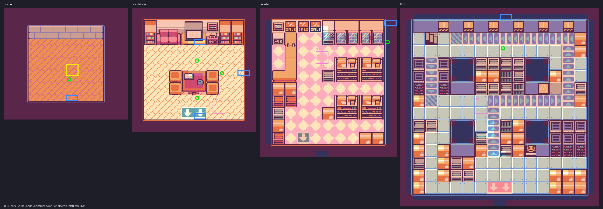
<br>
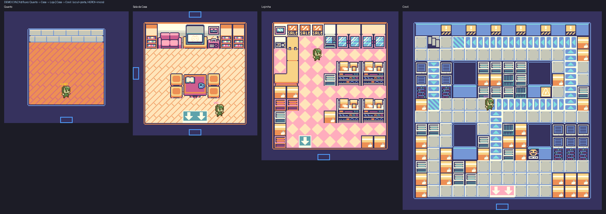
</div>

### 14.3 A tabela dos bugs pagos em sangue

| bug | causa raiz | lição permanente |
|---|---|---|
| player sumia ao tomar dano | referência de ator por número — e o slot 0 do runtime **é o player** | atores se referenciam por **UUID** |
| vida esvaziava num toque | script de dano re-disparava a cada frame de contato | i-frames = variável de guarda + `WAIT` |
| teleporte em cadeia infinito | spawn de uma porta caía em cima da porta de volta | spawn entra **3 tiles pra dentro** |
| build quebrava no `EVENT_WAIT` | campo tipo "value" exige objeto `{type,value}`, não número cru | ler o compilador antes de escrever o JSON |
| escolha de herói não persistia | trocar de cena **reseta o sprite do player** ao padrão | estado global em variável + re-aplicar no init de cada cena |
| personagens fora da sala | detecção de chão elegeu a moldura externa | chão não encosta na borda do canvas |
| aviso de 23 paletas | 4-uplas de cores livres demais nos tiles | encaixador de paletas (§9) |

Cada linha dessa tabela custou um ciclo completo de *build → jogar → xingar →
diagnosticar → corrigir*. É o changelog emocional do projeto.

## 15. O que NÃO fizemos (e como se faria)

Honestidade científica: a CINZA para onde o hardware continua. O caminho de cada coisa
que falta:

- **Música.** O hUGEDriver já está na ROM — só não tem partitura. Compõe-se no
  hUGETracker em módulos que regem os 4 canais; o banco 6 está 94% vazio esperando.
- **Save de verdade.** O cartucho declara RAM+bateria; a SRAM em `0xA000` persiste
  sozinha. Falta um `EVENT_SAVE_DATA` num ponto de save — o slime de poupança que todo
  RPG merece.
- **Efeitos de raster.** Mudar `SCX` durante o HBlank, linha a linha, produz ondulação
  (água, calor, a "distorção de chefe" clássica); mudar o mapa no meio do quadro
  divide a tela (HUD fixo em cima + mundo rolando embaixo — a window (§7.2) faz o
  mesmo com menos suor).
- **HDMA do GBC**: transferir até 16 bytes para a VRAM automaticamente **a cada
  HBlank** — streaming de tiles gota a gota, sem estourar o VBlank. É como jogos GBC
  animam fundos inteiros.
- **Double speed** (`KEY1` + `STOP`): dobra a CPU para 8.4 MHz mantendo PPU e APU —
  mais lógica por quadro. A CINZA nem chega perto de precisar.
- **Link cable**: a porta serial (`0xFF01/02`) troca **1 byte por vez**, com um lado
  fornecendo o clock. A troca de Pokémon inteira é protocolo em cima de um byte
  síncrono — e o `:cli` deste emulador já usa a serial para capturar a saída dos
  testes do Blargg (o mesmo hardware, outro uso).
- **RTC do MBC3**: um cristal no cartucho, alimentado pela bateria do save, conta o
  tempo com o console desligado — as bagas de Pokémon Gold/Silver. Este emulador
  implementa MBC3+RTC; a CINZA usa MBC5, que não tem.
- **SGB**: bordas e paletas via Super Nintendo — um console mandando pacotes pro outro
  pela porta de cartucho. Flag `0x146`, protocolo próprio, mundo à parte.
- **Tiles dinâmicos / metatiles**: animar cachoeiras trocando o *conteúdo* dos tiles
  na VRAM (o mapa nem percebe); e definir mapas em blocos de 2×2 tiles ("metatiles")
  para caber 4× mais mundo na mesma ROM.

## 16. Validação: a cadeia de confiança

Como saber que uma ROM homebrew "está certa" sem possuir o hardware? Três elos:

1. **A ROM**: os dois checksums batem; a boot ROM de um DMG/GBC físico a aceitaria.
2. **O emulador**: passa Blargg `cpu_instrs` (10/10), `instr_timing`, `mem_timing`,
   `02-interrupts`, 24 testes mooneye (timer, banking, DAA), e renderiza **dmg-acid2 e
   cgb-acid2 pixel-perfect** — comparação imagem a imagem na suíte de testes.
3. **A execução**: a CINZA roda nesse emulador do título à tela de vitória.

Se o emulador se comporta como o hardware (elo 2), e a ROM se comporta no emulador
(elo 3), então a ROM se comportaria no hardware — verificação por transitividade.
O que este projeto inteiro exercitou é que **os dois lados da transitividade podem ser
construídos em casa**.

<div align="center">
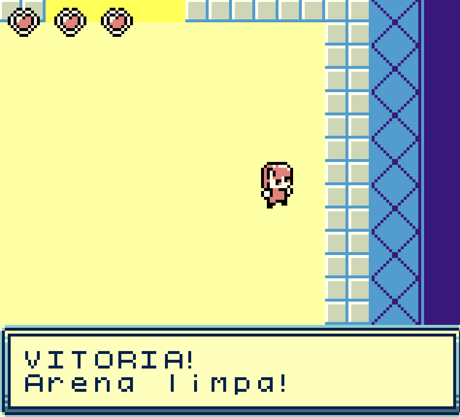

<sub><b>VITORIA! Arena limpa!</b> — o elo 3, fotografado.</sub>
</div>

## 17. Curiosidades históricas

- O Game Boy original (1989) vendeu, somado ao Color (1998), **quase 120 milhões de
  unidades** — com uma CPU que já era modesta em 1989. Eficiência > potência.
- A tela do DMG tem 4 tons de **verde** porque o LCD verde-oliva era o mais barato e
  o de menor consumo — 4 pilhas AA duravam ~30 horas.
- O SM83 não tem instrução de multiplicação. **Nenhum** Pokémon jamais multiplicou dois
  números em uma instrução: dano, stats, tudo é soma em loop e deslocamento de bits.
- Jogos "GBC enhanced" (flag `0x80`, como a CINZA) rodam num DMG em tons de cinza —
  compatibilidade decidida por 1 byte no cabeçalho.
- O flicker de sprites (>10 por linha) era tão universal que virou estética: emular
  Game Boy "certo demais" (sem flicker) denuncia emulador ruim.
- Há jogos feitos no GB Studio **vendidos hoje em cartucho físico** — a plataforma
  morreu comercialmente em 2003, a comunidade nunca aceitou.

## 18. Trabalhos futuros

Em ordem de retorno por esforço:

1. **Trilha sonora** (hUGETracker) — o driver está na ROM, o banco 6 está vazio, e SFX
   de UI já temos no acervo do projeto.
2. **Ponto de save** (`EVENT_SAVE_DATA`) — a bateria declarada no cabeçalho merece uso.
3. **Mais salas** — o gerador aceita qualquer PNG do acervo (corredores, escadas,
   escola prontos); o funil é só desenhar as conexões.
4. **Knockback + drops** na arena — o combate pede recuo no dano e recompensa por slime.
5. **Um segundo "capítulo" do tour do Bit** — sobre a APU e o som, quando a trilha existir.
6. **Rodar em hardware real** — gravar num cartucho flash e fechar o elo que falta da
   cadeia de confiança com uma foto: a CINZA num Game Boy de verdade.

## 19. Galeria

<div align="center">
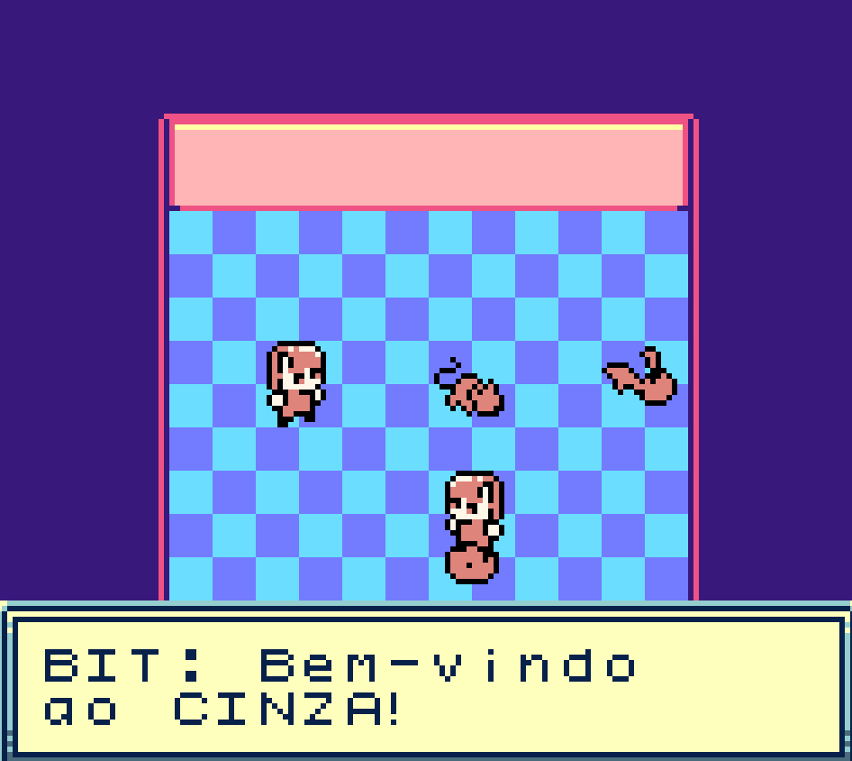 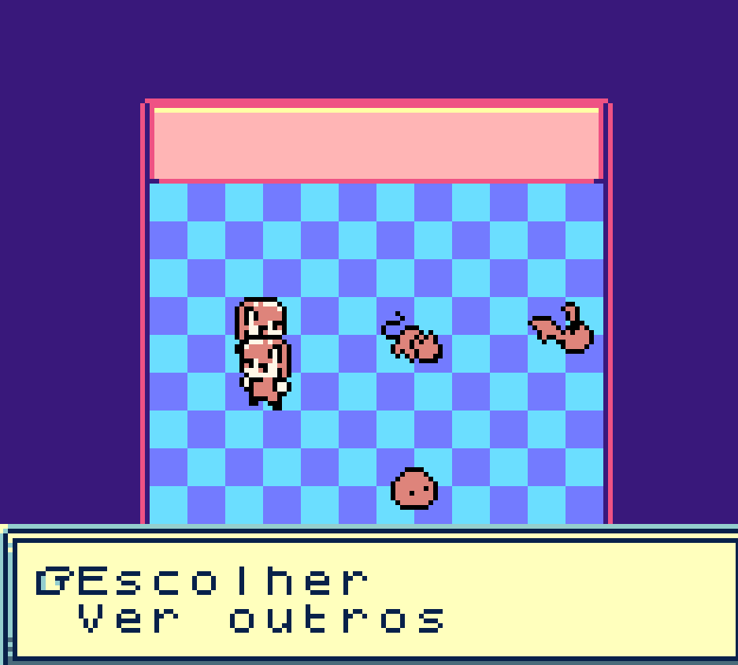
<br>
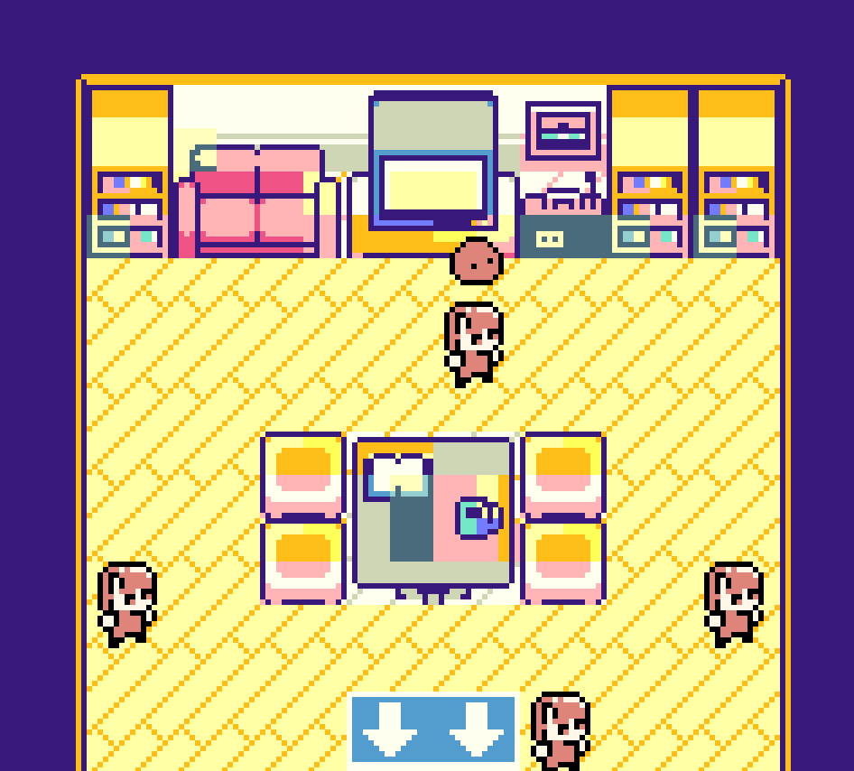 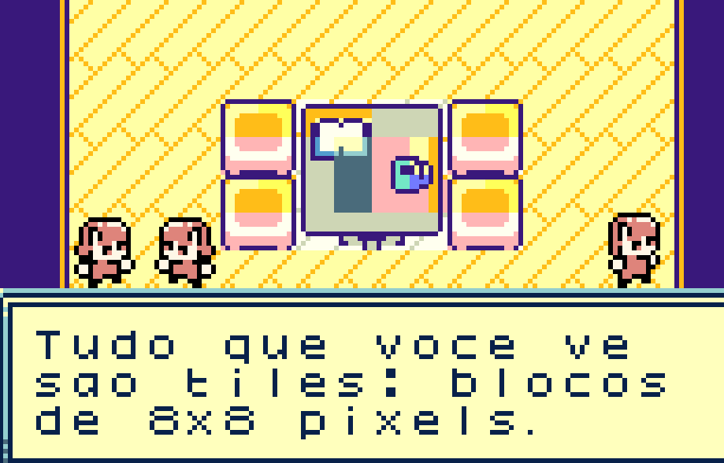
<br>
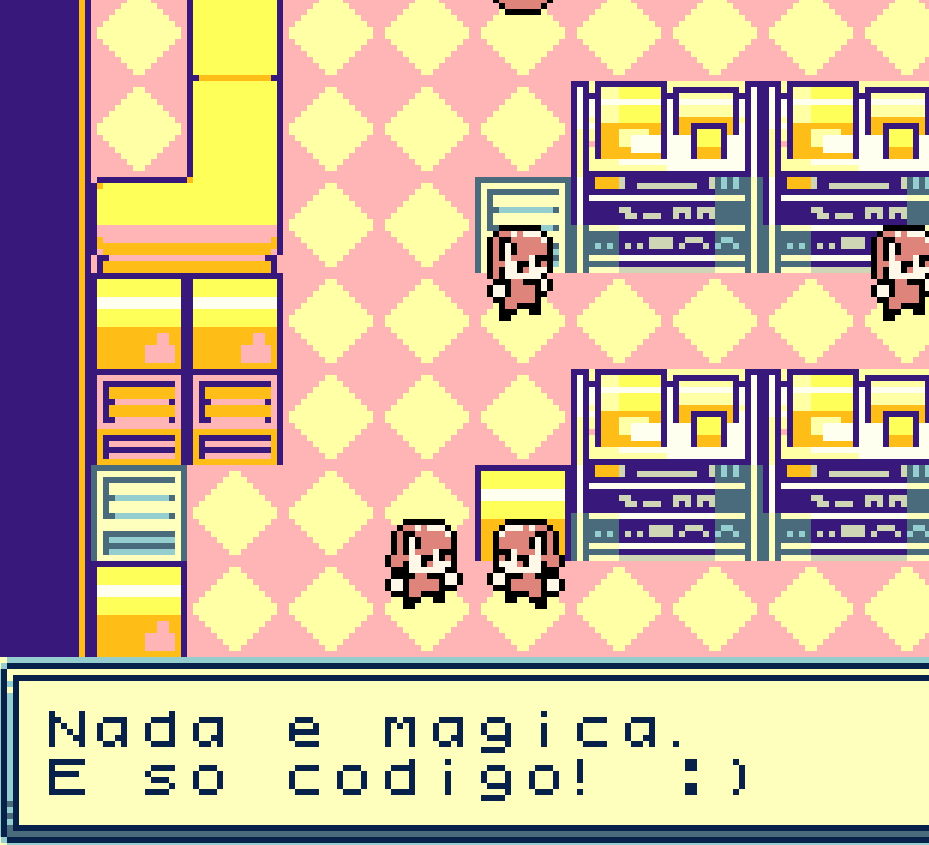 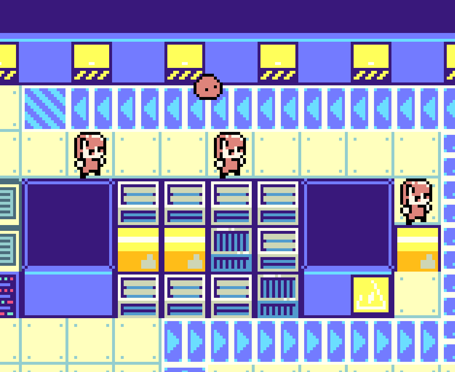
<br>
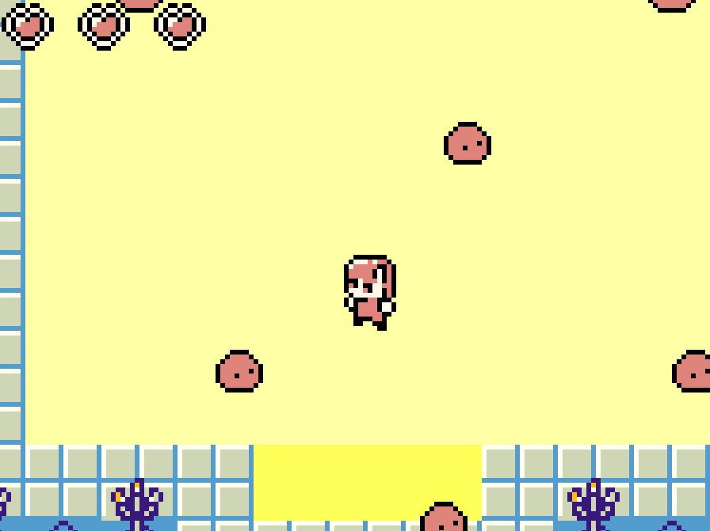 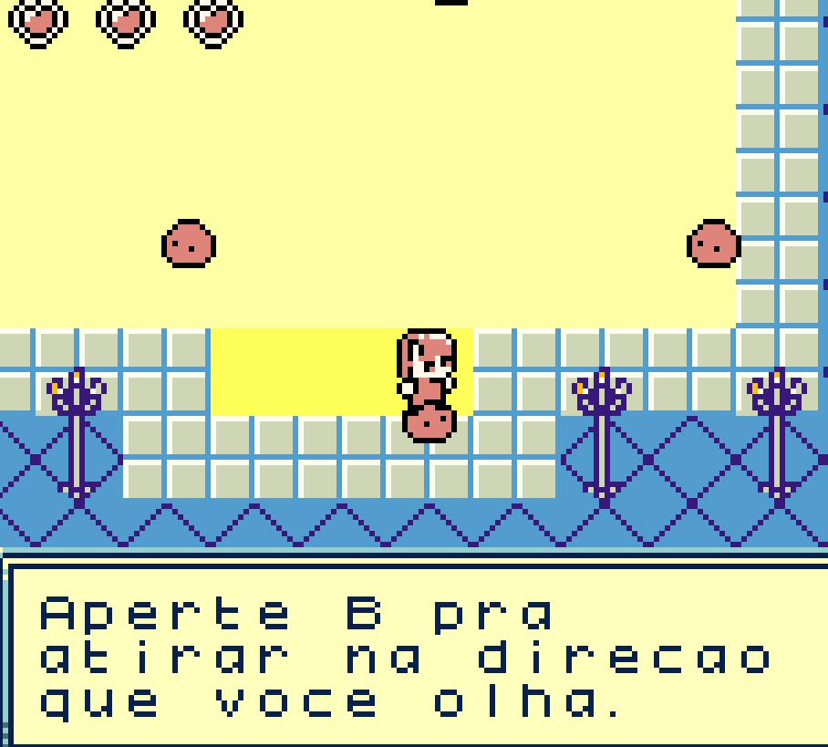
</div>

## Referências

- [Pan Docs](https://gbdev.io/pandocs/) — a referência técnica canônica do Game Boy (comunidade gbdev)
- [Gameboy Development Wiki](https://gbdev.gg8.se/wiki/) e o [Awesome Game Boy Development](https://github.com/gbdev/awesome-gbdev)
- [GB Studio](https://www.gbstudio.dev/docs/) — editor e engine GBVM
- [GBDK-2020](https://github.com/gbdk-2020/gbdk-2020) — toolchain C (SDCC) para Game Boy
- [hUGETracker / hUGEDriver](https://github.com/SuperDisk/hUGETracker) — composição e driver de música
- ROMs de teste: [Blargg](https://github.com/retrio/gb-test-roms) · [mooneye-test-suite](https://github.com/Gekkio/mooneye-test-suite) · [dmg-acid2](https://github.com/mattcurrie/dmg-acid2) / [cgb-acid2](https://github.com/mattcurrie/cgb-acid2)
- O emulador que executa tudo isto: [README na raiz](../../README.md)

---

<div align="center">

**Eu comecei querendo jogar Pokémon e acabei criando um emulador e uma ROM. Vai entender..**

<br>

<a href="../../CONSTRUCAO.md"></a>
<a href="../../README.md"></a>
<a href="../../CONTRIBUTING.md"></a>

</div>
